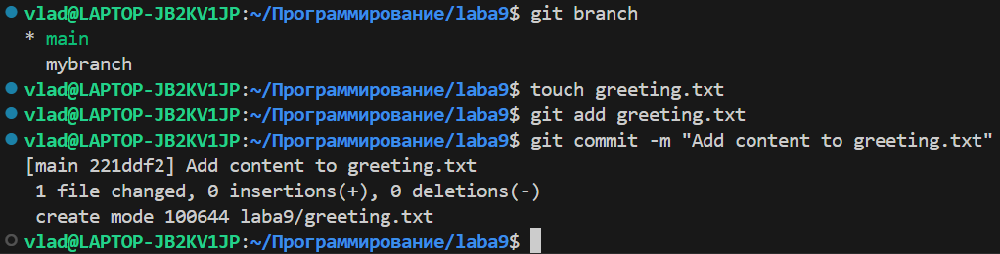
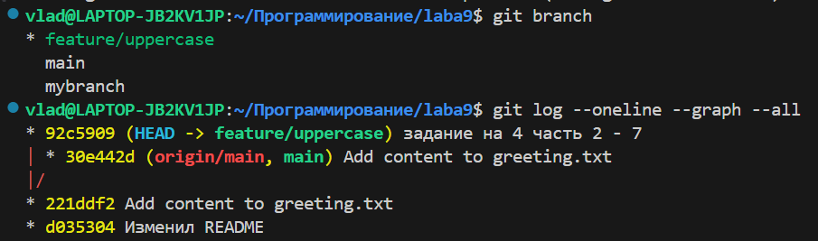
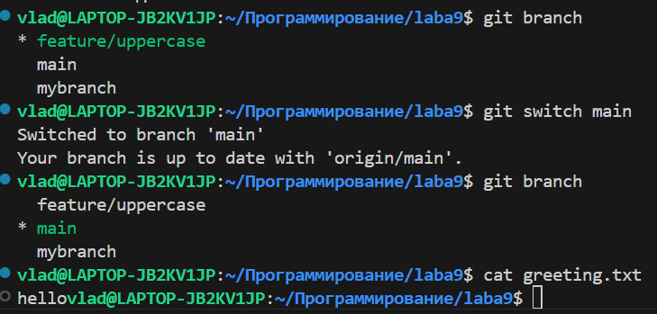
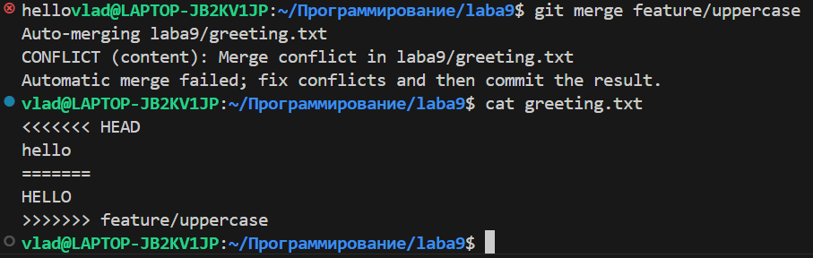
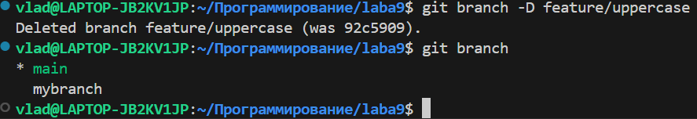
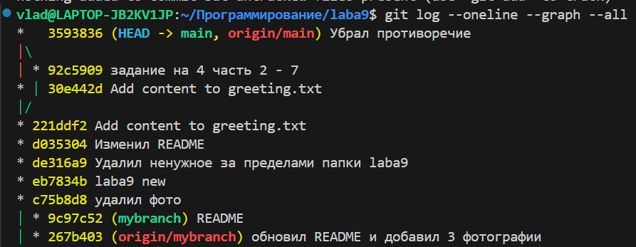
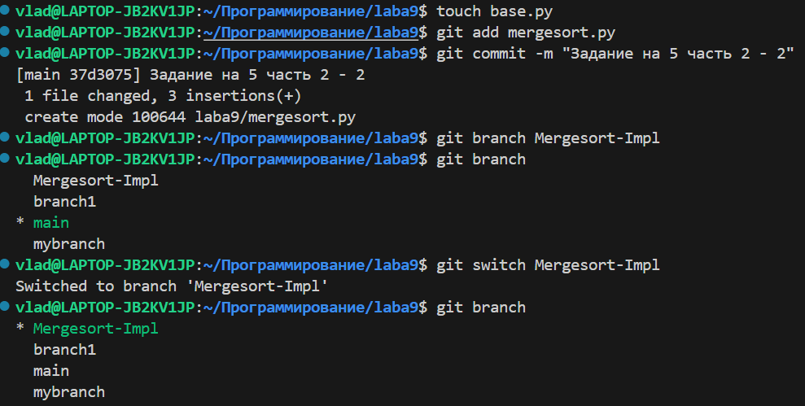
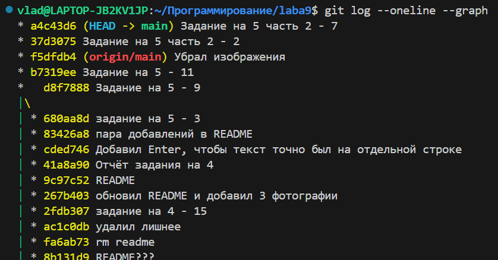

# Задания на 3

1) Нахожусь на ветке main

2) git log выглядит так:

3) Добавился файл sort.c

4) sort.c убралась из списка файлов "Untracked files" и переместилась в список "Changes to be committed"

5) закоммитились 2 файла: README и sort.c

6) Исчезли файлы README (он исчез, просто я сразу добавляю в него информацию для отчёта) и sort.c из списка "Changes not staged for commit"

7) Файл sort.c снова появился в списке "Changes not staged for commit", но с припиской "modified"

8) sort.c снова в "Changes to be committed"

9) sort.c снова в "Changes not staged for commit". При вводе git commit появился новый коммит

10) Запушил

11) Создал новую ветку и переключился на неё. git status показывает в начале, что я нахожусь на другой ветке

12) Проверил, что нахожусь на ветке mybranch. Создал файл file1_Vlad.txt и закоммитил его. Проверил, что ветка указывает на новый коммит

13) Переключился на основную ветку. Исчез коммит, который был в другой ветке

14) Создал файл file2.txt и закоммитил его. Посмотрел, что ветки теперь две

15) Переключился на другую ветку. Файл file2.txt пропал и его коммит тоже

# Задания на 4

1) Показывает, что изменилось в коде.  git diff --staged пустой. После add стало наоборот

2) git diff показывает изменения в коде, которые я сделал сейчас, а git diff --staged показывает изменения в коде, которые были сделаны в прошлый раз

3) после того, как мы добавили строку printf(“hello git\n”) git status просто показывает, что sort.c 'Changes not staged for commit', после  git restore sort.c sort.c исчез

4) Создал новый файл на ветке main и закоммитил его

5) Создал новую ветку. В git status ничего необычного

6) Когда изменил текст, закоммитил его при использовании git log --oneline --graph --all появилась новая ветка

7) Переключился на main. Команда cat выдала приветствие в нижнем регистре

8) Из-за различной информации в одной и той же строке возник конфликт

9) Удалил ветку

10) Смержил main и mybranch

# Задание на 5

1) Создал новую ветку, переключился на неё, создал там файл и закоммитил его

2) Переместился на ветку main, создал там файл и закоммитил его. git log --oneline --graph --all показывает оба комммита

3) Как и написано в задании, смержить не удалось. Ошибка произошла потому что в одинаковых строках содержится разная информация. git status показывает, что 2 файла несмерживаемые. Исправил, закоммитил

4) Создал mergesort.py, добавил туда содержимое, закоммитил. Создал новую ветку Mergesort-Impl и переключился на неё

5) Изменил содержимое питоновского файла и закоммитил это. Переключился на ветку main и поменял содержимое этого же файла, но на другой ветке. В отличие от git log с флагом -all, git log --oneline --graph показывает коммиты только ветки main, т.е. коммита питоновского файла, который был на другой ветке, нет

