Нахожусь на ветке main

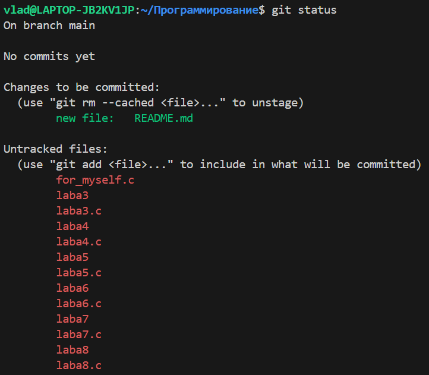

git log выглядит так:

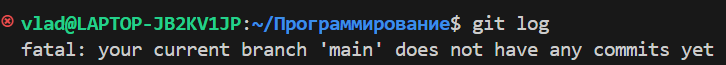

Добавился файл sort.c

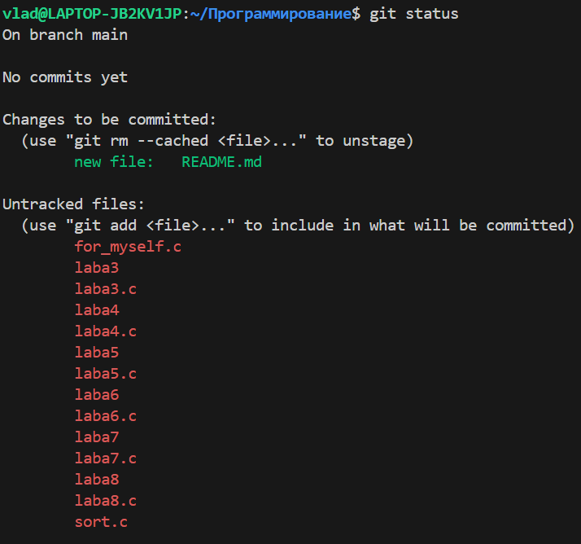

sort.c убралась из списка файлов "Untracked files" и переместилась в список "Changes to be committed"

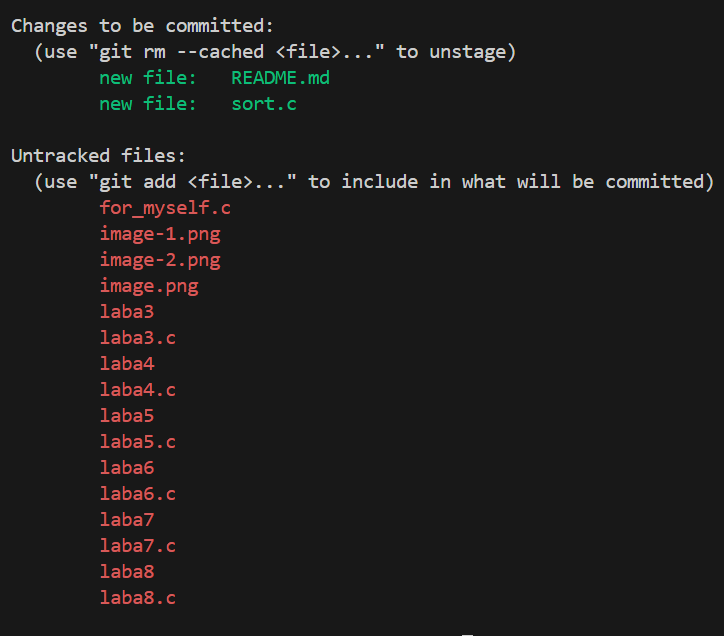

закоммитились 2 файла: README и sort.c

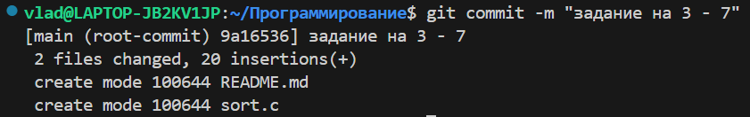

Исчезли файлы README (он исчез, просто я сразу добавляю в него информацию для отчёта) и sort.c из списка "Changes not staged for commit"

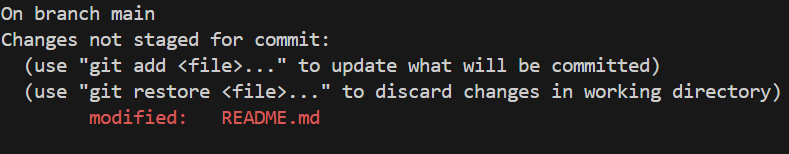

Файл sort.c снова появился в списке "Changes not staged for commit", но с припиской "modified"

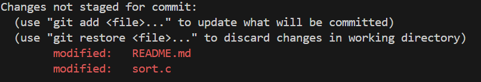

sort.c снова в "Changes to be committed"

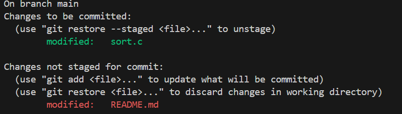

sort.c снова в "Changes not staged for commit". При вводе git commit появился новый коммит

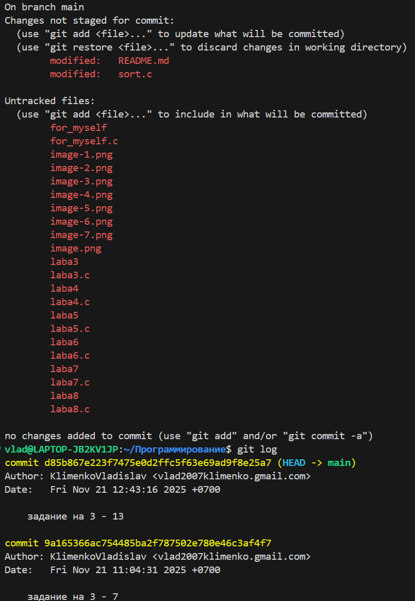

Запушил

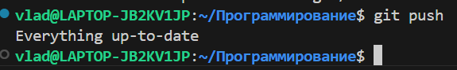

Создал новую ветку и переключился на неё. git status показывает в начале, что я нахожусь на другой ветке

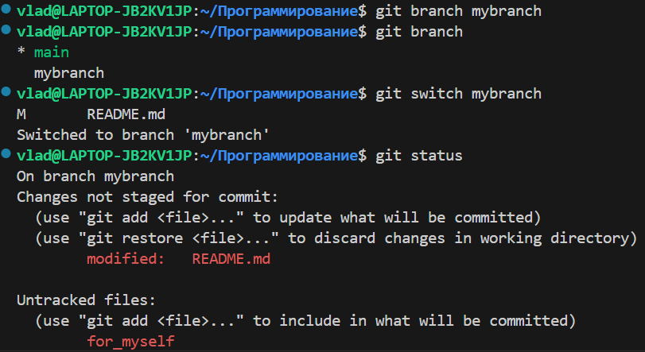

Проверил, что нахожусь на ветке mybranch. Создал файл file1_Vlad.txt и закоммитил его. Проверил, что ветка указывает на новый коммит

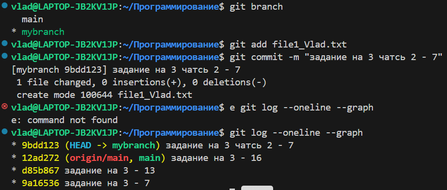

Переключился на основную ветку. Исчез коммит, который был в другой ветке

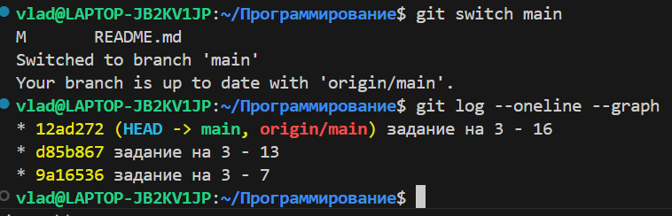

Создал файл file2.txt и закоммитил его. Посмотрел, что ветки теперь две

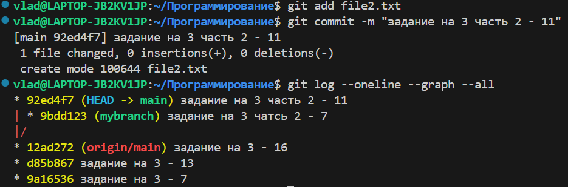

Переключился на другую ветку. Файл file2.txt пропал и его коммит тоже

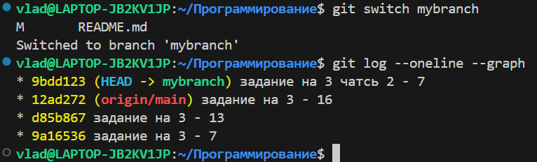

Показывает, что изменилось в коде.  git diff --staged пустой. После add стало наоборот

git diff показывает изменения в коде, которые я сделал сейчас, а git diff --staged показывает изменения в коде, которые были сделаны в прошлый раз

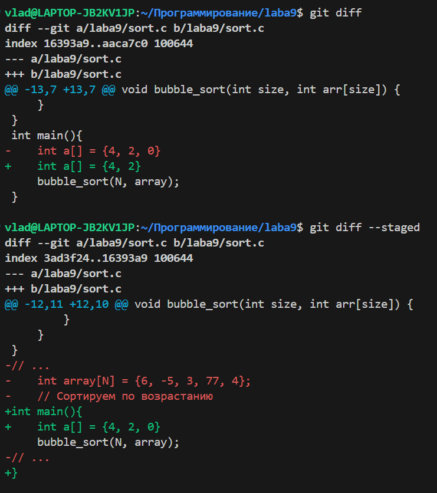

после того, как мы добавили строку printf(“hello git\n”) git status просто показывает, что sort.c 'Changes not staged for commit', после  git restore sort.c sort.c исчез

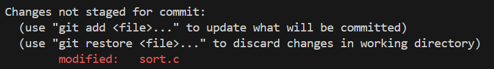

